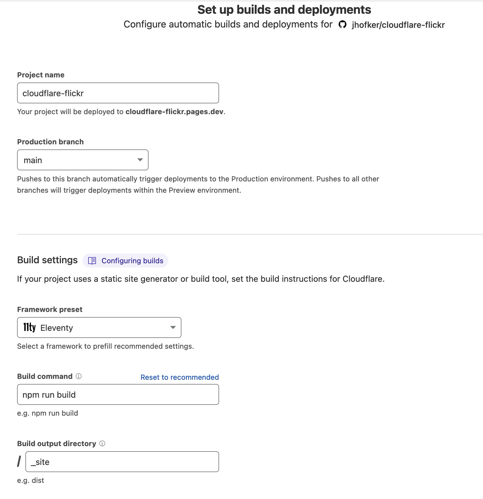

# cloudflare-flickr

I'm seeing 502s when my site build on Cloudflare tries to request a Flickr asset. Thank you for taking a look at this issue!

To run this:

- Fork the repo
- Log in to Cloudflare (create a free account)
- Go to Workers & Pages
- Click Create Site
- Set it up as below

